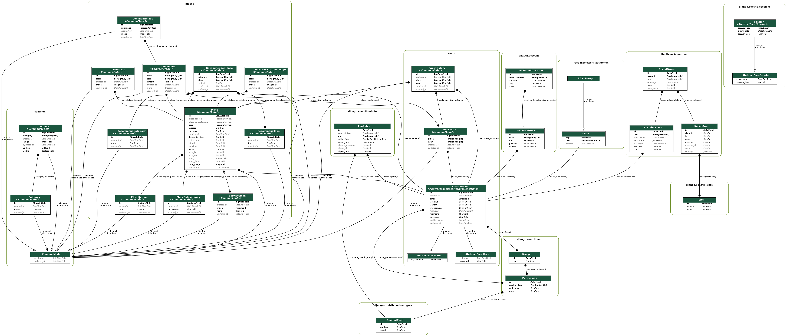

# 애개플레이스

## 프로젝트 개요

`애개플레이스`는 반려동물과 아이들이 함께 즐길 수 있는 공간과 서비스를 제공하는 애플리케이션입니다. 이 플랫폼은 사용자들이 애견과 아이들을 위한 장소를 검색하고, 추천 받으며, 다른 사용자와 의견을 나눌 수 있도록 설계되었습니다. 또한, 사용자 개인의 경험을 기반으로 북마크, 댓글, 방문 기록 등을 관리할 수 있는 다양한 기능을 포함하고 있습니다.

[테이블정의서](https://docs.google.com/spreadsheets/d/1FK29LM8E9eiwrJ3kE7j0BerM2Kn8ZuyMTM1T8mpuOfo/edit?gid=0#gid=0)


## 주요 기능

### 1. **메인 페이지 및 배너**
- **배너 관리**: 메인 페이지에서 볼 수 있는 배너를 통해 다양한 카페, 펜션, 레스토랑 등의 장소를 소개합니다. 각 배너는 URL 링크와 이미지를 포함하며, 새로운 장소와 이벤트를 소개하는 역할을 합니다.
  
### 2. **장소 정보**
- **전체 장소 조회**: 특정 지역이나 카테고리로 필터링하여 반려동물과 아이들이 함께할 수 있는 장소를 조회할 수 있습니다.
- **추천 장소**: 추천 장소 기능을 통해 사용자는 카페, 펜션, 공원 등 아이와 반려동물이 함께할 수 있는 인기 있는 장소를 탐색할 수 있습니다.
  
### 3. **북마크 및 방문 기록 관리**
- **북마크 기능**: 사용자는 마음에 드는 장소를 북마크하여 나중에 쉽게 찾을 수 있습니다. 각 사용자의 북마크 목록은 개인화되어 관리됩니다.
- **방문 기록 관리**: 최근 방문한 장소에 대한 기록을 남기고 이를 기반으로 다른 장소를 추천받을 수 있습니다.

### 4. **유저 프로필 관리**
- **프로필 이미지 업데이트**: 사용자는 자신의 프로필 사진을 업로드하거나 URL을 통해 이미지를 업데이트할 수 있습니다.
- **닉네임 변경**: 사용자는 닉네임을 쉽게 변경할 수 있으며, 공백만 입력되거나 중복된 닉네임은 사용할 수 없습니다.

### 5. **댓글 및 평가**
- **댓글 작성 및 이미지 첨부**: 사용자는 특정 장소에 대해 리뷰를 작성하고, 이미지와 함께 평가를 남길 수 있습니다.
- **평가 기능**: 장소에 대해 1~5점 사이의 평점을 부여하여 다른 사용자들이 장소를 선택하는 데 도움을 줄 수 있습니다.

## API 설명
[스웨거 페이지](https://oz-coding-school.github.io/oz_03_collabo-001-BE/)

### 1. **장소 조회 API**
- 사용자들은 특정 카테고리, 지역, 정렬 방식에 따라 장소를 조회할 수 있습니다. 또한, 위도와 경도를 사용하여 가까운 순으로 장소를 정렬할 수 있습니다.

### 2. **유저 프로필 API**
- 프로필 이미지 및 닉네임을 관리하는 API입니다. 사용자는 프로필 사진을 S3 버킷에 업로드하고, 닉네임을 변경할 수 있습니다.
- 닉네임 변경 시에는 공백 제거 및 중복 검사를 통해 적절한 닉네임을 설정할 수 있습니다.

### 3. **북마크 및 방문 기록 API**
- 사용자가 북마크한 장소와 방문 기록을 조회할 수 있는 API입니다. 최근 방문한 3개의 장소와 북마크한 3개의 장소를 빠르게 확인할 수 있습니다.

### 4. **댓글 및 평점 API**
- 특정 장소에 대한 댓글 작성, 이미지 첨부, 평점 부여 등을 할 수 있습니다. 이를 통해 다른 사용자들은 장소에 대한 상세 정보를 얻을 수 있습니다.

## 사용된 기술 스택

- **Backend**: Django Rest Framework, Python
- **Database**: PostgreSQL
- **File Storage**: AWS S3 (이미지 저장소)
- **Geolocation**: Geopy (위도, 경도 기반 거리 계산)


# 프론트엔드 로컬 개발을 위해 Docker로 환경 설정 및 실행

### 1. 도커 데스크탑 설치

[도커사이트](https://www.docker.com/)

### 2. 깃클론

```bash
git clone https://github.com/OZ-Coding-School/oz_03_collabo-001-BE.git
```

### 3. 프로젝트 폴더로 이동

```bash
cd oz_03_collabo-001-BE
```

### 4. 독커 컴포즈 실행

```bash
docker-compose -f docker-compose-dev.yml up
```

### 스웨거 페이지 (API 테스트)

```bash
http://127.0.0.1:8000/swagger/
```

### 리독 페이지 (API 문서)

```bash
http://127.0.0.1:8000/redoc/
```

